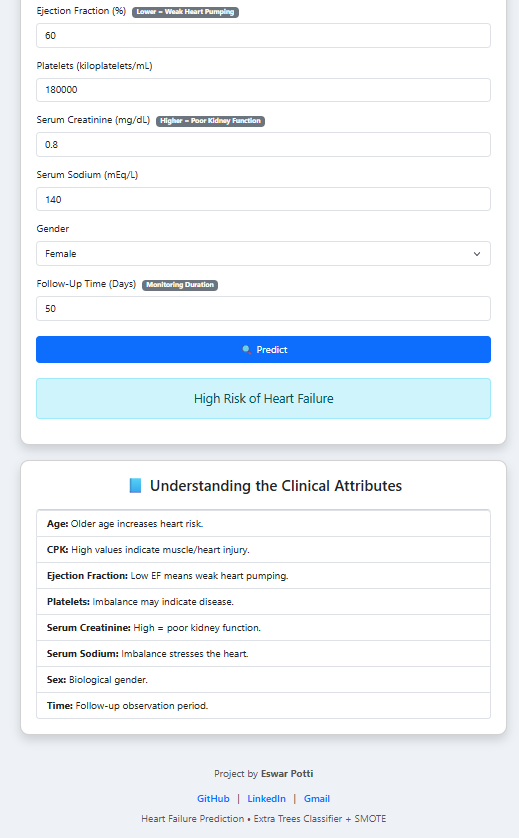

# ❤️ Heart Failure Risk Prediction (FastAPI + Machine Learning)

This project is a **web-based Heart Failure Risk Prediction System** built using **FastAPI**, **Extra Trees Classifier**, and **SMOTE**.  
It takes key clinical features as input and predicts whether a patient is at **High Risk** or **Low Risk** of heart failure.

The model is trained on the **Heart Failure Clinical Records** dataset and deployed using FastAPI with a clean Bootstrap-based UI.

----------

## 📁 Project Structure

```
Heart_Prediction/
│
├── Heart_prediction_app/
│   ├── templates/
│   │   ├── index.html
│   │   ├── heart_model.pkl
│   │   ├── model_columns.pkl
│   │   └── api.py
│
├── venv/
│
├── heart_model.pkl
├── model_columns.pkl
├── test_model.py
├── requirements.txt
├── Heart_Disease_Prediction.py
├── heart_failure_clinical_records_dataset.csv
└── BASE PAPER.pdf

```

----------

## 🚀 Features

-   🧠 Machine Learning Model (Extra Trees Classifier)
    
-   🔄 SMOTE applied for balanced data
    
-   ⚡ Real-time predictions using FastAPI
    
-   🎨 Modern UI with Bootstrap 5
    
-   📊 Takes clinical inputs such as:
    
    -   Age
        
    -   CPK
        
    -   Ejection Fraction
        
    -   Platelets
        
    -   Serum Creatinine
        
    -   Serum Sodium
        
    -   Sex
        
    -   Follow-up Time
        

----------

## 🖥️ Demo Screenshot



----------

## 🔧 Installation & Setup

### **1️⃣ Clone the Repository**

```bash
git clone https://github.com/YOUR_USERNAME/Heart_Prediction.git
cd Heart_Prediction

```

### **2️⃣ Create a Virtual Environment**

```bash
python -m venv venv

```

### **3️⃣ Activate Virtual Environment**

#### Windows:

```bash
venv\Scripts\activate

```

#### macOS/Linux:

```bash
source venv/bin/activate

```

### **4️⃣ Install Dependencies**

```bash
pip install -r requirements.txt

```

----------

## ▶️ Running the FastAPI App

Inside the project directory:

```bash
uvicorn Heart_prediction_app.api:app --reload

```

### The app will run at:

```
http://127.0.0.1:8000/

```

----------

## 🧪 Testing the Model

You can test predictions without UI using:

```bash
python test_model.py

```

Modify input values inside the script for quick offline testing.

----------

## 📊 Model Details

-   **Algorithm:** Extra Trees Classifier
    
-   **Dataset:** Heart Failure Clinical Records
    
-   **Preprocessing:**
    
    -   Missing value handling
        
    -   Feature scaling
        
    -   Class balancing using **SMOTE**
        

----------

## 📝 API Endpoints

### **GET /**

Returns the HTML form for input.

### **POST /**

Receives form data → Predicts → Renders result on same page.

Example of request data:

```json
{
  "age": 60,
  "creatinine_phosphokinase": 250,
  "ejection_fraction": 30,
  "platelets": 210000,
  "serum_creatinine": 1.2,
  "serum_sodium": 137,
  "sex": 1,
  "time": 50
}

```

Response:

```
High Risk of Heart Failure

```

----------

## 🌐 UI Page (index.html)

-   Built using Bootstrap 5
    
-   Clean medical theme
    
-   Auto-clears fields on hard reload
    
-   Provides clinical attribute explanations
    
-   Displays prediction result in real time
    

----------

## 📬 Author

**Eswar Potti**

-   GitHub: [https://github.com/eswarpotti3](https://github.com/eswarpotti3)
    
-   LinkedIn: [https://www.linkedin.com/in/eswar-potti/](https://www.linkedin.com/in/eswar-potti/)
    
-   Email: [potti.eswar3@gmail.com](mailto:potti.eswar3@gmail.com)
    

----------

## ⭐ Contribute

Want to improve UI or add new ML models?  
Feel free to open issues or send pull requests!

----------

## 📄 License

This project is open-source under the **MIT License**.
